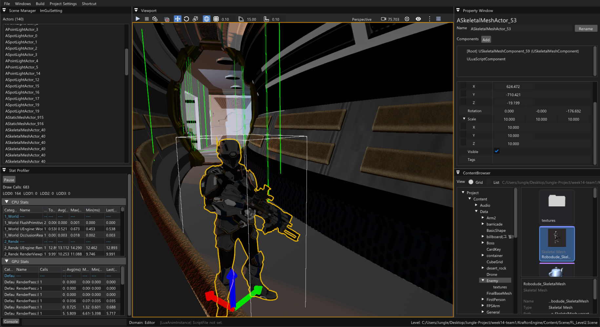

# Jungle GameTechLab Projects



정글 게임테크랩 Week 01~14 팀 프로젝트를 하나로 모은 소스 중심 아카이브입니다.

각 프로젝트의 기본 브랜치 이력은 `main`에 `Week01/`~`Week14/` 경로로 병합했습니다. 기본 브랜치가 아닌 브랜치도 `archive/weekXX/bNNN/<original-name>` 형식으로 보존했습니다. `bNNN`은 Windows에서 대소문자 또는 경로가 충돌하는 Git 브랜치를 함께 보존하기 위한 고유 식별자입니다.

## Projects

| Week | Original repository | Default branch |
| --- | --- | --- |
| 01 | [shimwoojin/Jungle_Week1_Team2](https://github.com/shimwoojin/Jungle_Week1_Team2) | `master` |
| 02 | [alogeclock/Jungle_Week2_Team7](https://github.com/alogeclock/Jungle_Week2_Team7) | `master` |
| 03 | [alogeclock/Jungle_Week3_Team4](https://github.com/alogeclock/Jungle_Week3_Team4) | `master` |
| 04 | [keonwookang0914/W4_Jungle_Team2](https://github.com/keonwookang0914/W4_Jungle_Team2) | `main` |
| 05 | [alogeclock/Jungle_Week5_Team7](https://github.com/alogeclock/Jungle_Week5_Team7) | `main` |
| 06 | [jskim-research/Jungle_Week6_Team4](https://github.com/jskim-research/Jungle_Week6_Team4) | `main` |
| 07 | [kwonhyeonsoo-goo/Jungle_Week7_Team3](https://github.com/kwonhyeonsoo-goo/Jungle_Week7_Team3) | `main` |
| 08 | [DDing-Ho/Jungle_Week8_Team8](https://github.com/DDing-Ho/Jungle_Week8_Team8) | `main` |
| 09 | [alogeclock/Jungle_Week9_Team1](https://github.com/alogeclock/Jungle_Week9_Team1) | `main` |
| 10 | [HaXX0rBunny/Jungle_Week10_Team5](https://github.com/HaXX0rBunny/Jungle_Week10_Team5) | `main` |
| 11 | [alogeclock/Jungle_Week11_Team8](https://github.com/alogeclock/Jungle_Week11_Team8) | `main` |
| 12 | [alogeclock/Jungle_Week12_Team4](https://github.com/alogeclock/Jungle_Week12_Team4) | `main` |
| 13 | [esc10946/Jungle_Week13_Team8](https://github.com/esc10946/Jungle_Week13_Team8) | `main` |
| 14 | [deepBeom/Jungle_Week14_Team1](https://github.com/deepBeom/Jungle_Week14_Team1) | `main` |

## Important limitations

이 저장소는 재배포 권리를 확인하기 어려운 미디어·모델·폰트 에셋, 빌드 결과물, 크래시 덤프와 25MB 초과 Blob을 전체 이력에서 제거했습니다. 따라서 일부 프로젝트는 원본 에셋을 별도로 준비하기 전에는 완전하게 빌드되거나 실행되지 않을 수 있습니다. 자세한 기준은 [CLEANUP_REPORT.md](CLEANUP_REPORT.md)를 참고하세요.

커밋의 작성자, 작성 시각, 메시지와 그래프 구조는 유지했지만 경로 변경과 파일 제거 때문에 커밋 SHA 및 서명은 원본과 달라졌습니다. 원본 팀원과 제3자 저작물의 권리는 각 권리자에게 있으며, 이 아카이브 전체에 단일 라이선스를 새로 부여하지 않습니다.

## Branch examples

```powershell
git branch --list "archive/week05/*"
git log --oneline -- Week05
git switch archive/week05/b011/main
```

